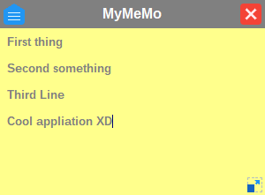
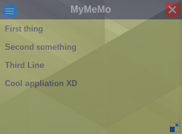
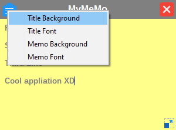

# MyMeMo

A simple note taking / memo application for Linux and Windows (and maybe Mac OS X). It simple as it's can. Single window with move, resize functionality, some customizations. That's it, no more, no less.

Note window, with focus:

Note window without focus:

Menu items:

## Installation

Download (or Clone), Compile (with [Lazarus](https://www.lazarus-ide.org/)), Run (with barve)

## Support

Are you joking?

## Tahks

Thank you [Icons8](https://icons8.com/) for the nice icons!
